# Termite Labs - 3D Printed Vibratory Tumbler 

Version Micro 0.5

This is a small vibratory tumbler I put together with my 3D printer and parts I had available at home, but the goal is to create an open source, affortable, easy to print and assemble vibratory tumbler, useful for finsishing and polishing 3D printed parts or other objects.

This is a prototype and I welcome any help to improve the design. See [Contributing](#contributing) to know more.

Photo, Video, Before/After

## Safety Warning
* This projects features a __rapidly spinning electric motor__ with an eccenric load
* __This can be dangerous, please be careful__ 
* __Do not assume this is safe just because it's on the Internet__ 
* __I can't accept any responsibility if you or someone else gets hurt or property is damaged__

## Disclosure
Some of the links on this page contain affiliate links. If you buy from that link, I receive a small percentage which I will spend to fund this and other projects.

## Table Of Contents

* [Parts to print](#printing-the-parts)
* [The other parts](#non-printed-parts)
* [Assemblying](#assemblying)
* [Using](#using)
* [Future](#future)
* [Contributing](#contributing)
* [Acknowledgements](#acknowledgements)

## Printing the parts

I printed my parts in eSun PLA+, 0.3mm layer height and medium speed for my printer. I recommend to use high setting for your layer height as it should make the parts stronger, at the cost of aesthetics. 

_(I designed this using Fusion 360, but I can't share the project to be edited by others because I'm using the free "hobby" version. Here is a [read-only link to the Fusion design](https://a360.co/3a8lYfV). Shout if you know how to fix this)_

## Materials

Collect your materials, then head on to the [Instructions](#instrcutions)

| Part | Instructions | Image |
|------|--------------|-------| 
| Frame Base | Print flat face down, no supports   [Download STL](Termite_Vibratory_Tumbler_Micro_V0.5-Frame_Base.stl) | 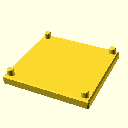
| Frame Base | Print flat face down, no supports   [Download STL](Termite_Vibratory_Tumbler_Micro_V0.5-Frame_Top.stl) | 
| Weight Part A | Print flat face down, supports only in the head part   [Download STL](Termite_Vibratory_Tumbler_Micro_V0.5-Weight_A.stl) | 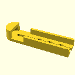
| Weight Part B | Print flat face down, no supports   [Download STL](Termite_Vibratory_Tumbler_Micro_V0.5-Weight_B.stl) | 
| DC Motor |  The frame and weight are designed to fit exactly this motor.    [Where to Buy]() | 
| 4 Springs | The is designed to fit exactly the springs dimensions.   [Where to Buy]() | 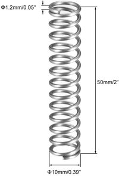
| Tumbling Container | I used what I had at home. Any round plastic cup approx 10cm (4") diameter should work. | 
| Screws and Bolts |   [Where to Buy]() | 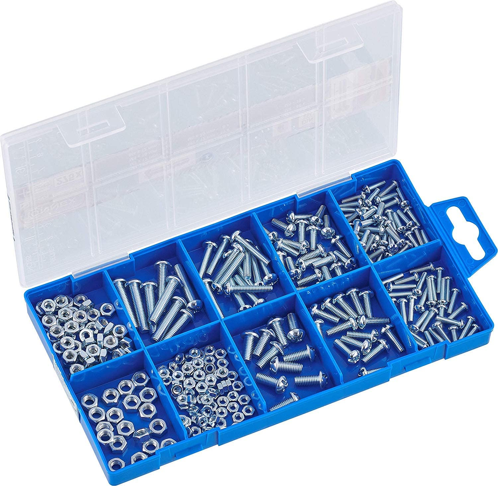
| Washers | I used plastic washers becaude thats what I had around, but any washers will do. [Where to Buy]() | 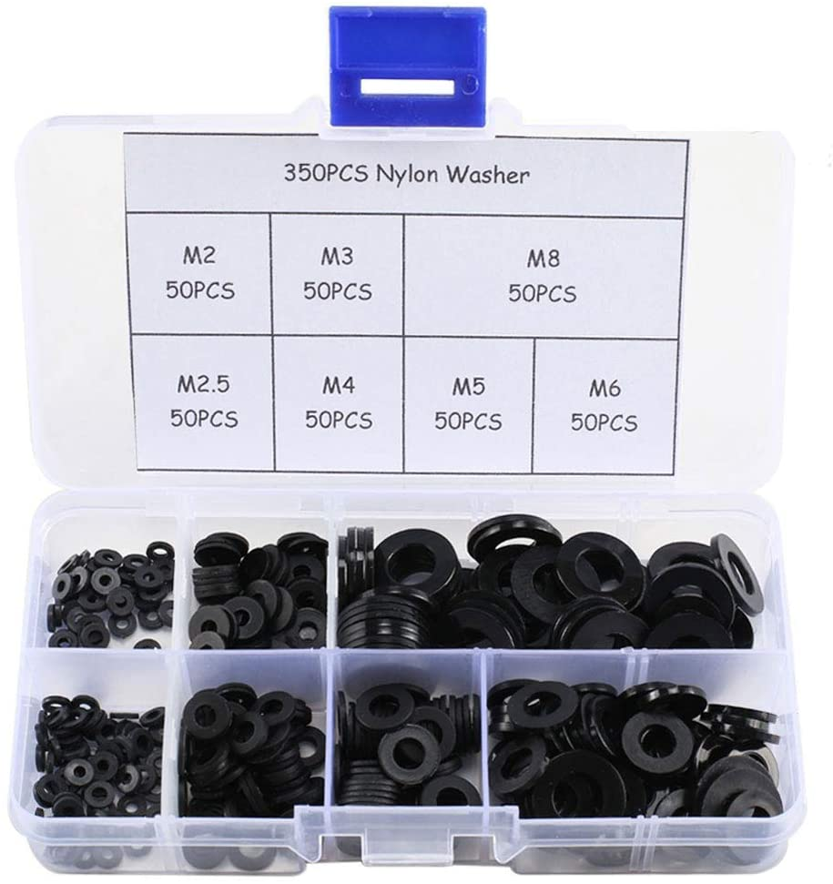

| 12V Power Adapter | I bought the ceapest 30W I could find. An adapter you already have may just work.   [Where to Buy]() | 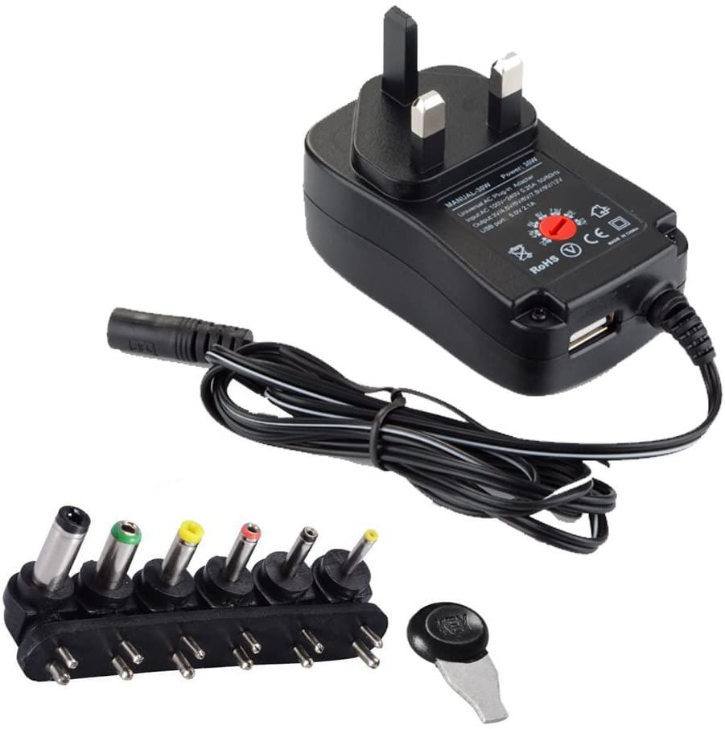
| Rubber Feet | This is optional at this point as they don't work too well to keep the tumbler for moving around, but they help somewhat. | 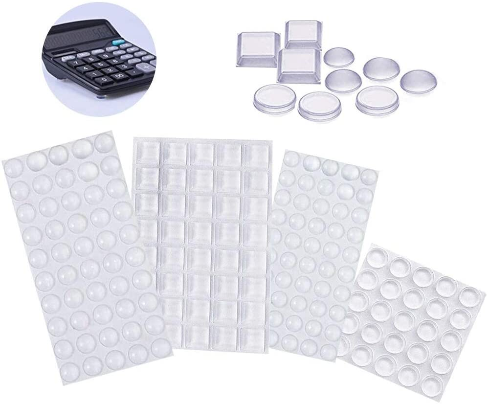
| Soldering Iron | Any soldering iron will do. I use an Hakko station and it'qrfrvfvava great.   [Where to Buy]() | 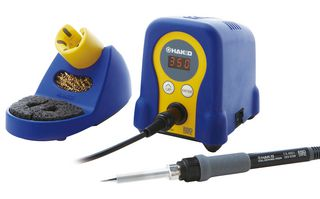 |
| Solder | Any solder should do. |   
| Pliers | Used to modify the motor.   [Where to Buy]() | 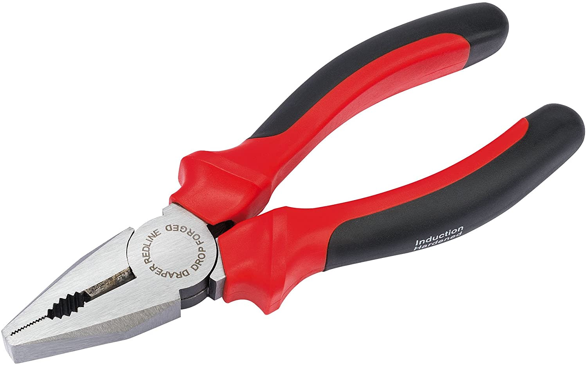 |
| Zip Ties | Used to fix the wiring to the motor   [Where to Buy]() | 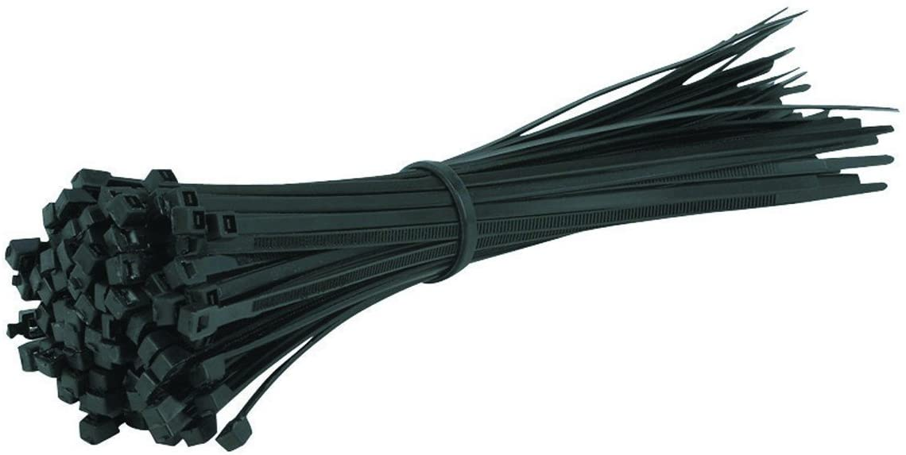
| Tape | Used to fix the wiring to the frame until we come up with a better design. Any tape you have around will work. | 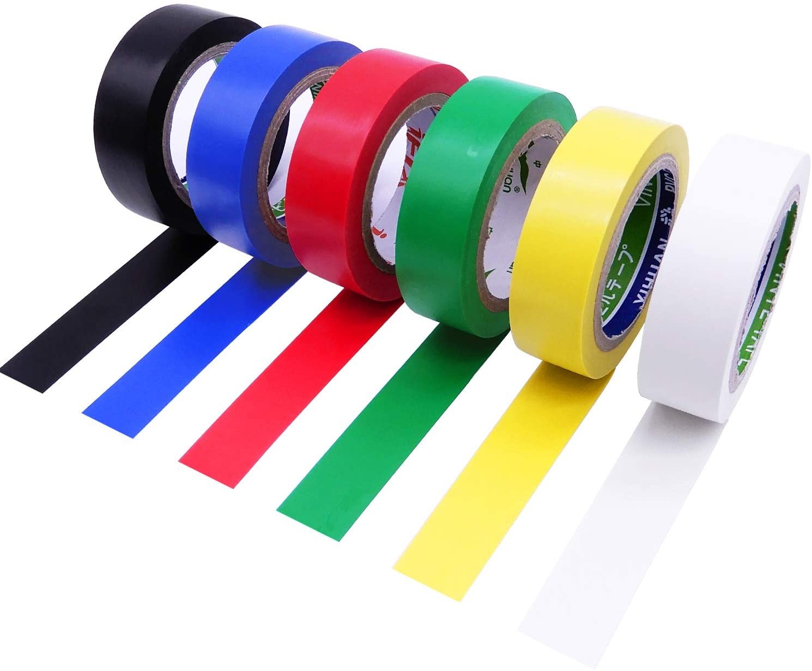

### Motor

 I used what I had around. In future versions I would like to use a more common motor (see [Contributing](#contributing)), but this seems to work for now with a small modification (see [Instructions](#instructions)). One good thing about this is that the existing counterweight doubles as an attachment for our own counterweight. On the bad side, this motor does not have any specs (power required or rotation speed)

 The parts are designed specifically around this motor, so you'll have to get exactly this one. I provided links for Amazon US and UK. If you find this part in other countries, or not on Amazon, please let me know and I will add it here.

| | |
|---|---|
| | [Amazon UK](https://amzn.to/2KFJTbL)   [Amazon US](https://www.amazon.com/dp/B07Y7V5QRH) 

### Springs

The base and top are designed specifically for springs of this size and length. I provided links for Amazon US and UK. If you find this part in other countries, or not on Amazon, please let me know and I can add it here.

| | |
|---|---|
| | [Amazon UK](https://www.amazon.co.uk/gp/product/B07M6JT46T/)   [Amazon US](https://www.amazon.com/uxcell-Diameter-Stainless-Extended-Compressed/dp/B07MHGLW1Q) (Out of stock on Dec 18th, 2020 - help me find a substitute)

### 12V Power Adapter

Any 12v power adapter should work. I bought the cheapest 30W I could find. Again, the motor has no specs so I don't know how much power it's actually using. 

* [Amazon UK](https://www.amazon.co.uk/gp/product/B07WHSB8C5/)
* [Amazon US](https://www.amazon.com/SoulBay-Universal-Switching-Selectable-Electronics/dp/B01N7RS0NG)

## Tools

You'll need a soldering iron and some solder to connect the motor. Any will do. I have a Hakko FX-888D and I love it, but any cheap iron will work too.

Of course you'll also need a 3D Printer. I have a Monoprice Voxel (which is the same as a FlashForge Adventurer 3). It's an entry level begineer printer, so you should be fine whater you have.

* [Soldering Station - Amazon UK](https://www.amazon.co.uk/HAKKO-FX-888D-Soldering-Station-70W/dp/B077B9Q6SJ)
* [Soldering Station - Amazon US](https://www.amazon.com/s?k=Hakko+FX-888D)

## Instructions

### 1. Motor

#### 1.2 Removing counterweight

The first thing to do is to remove the counterweight on the front of the motor. The part WITHOUT power connections. You'll need to grab the weight with a pair of pliers and it will come off easily.

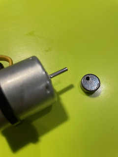

#### 1.3 Soldering

Solder two wires to the two connections on the other side. Use two different colors if possible. Then Tie the wires with a zip tie to keep the wires from moving around.

Connect the wires to the power adapter. I have soldered them to a female standard DC plug compatible with one of the adapters provided with the power brick.

The motor has a red dot near the positive connector. Connect it to the positive wire coming from the adapter. In standard plugs this is in the center.

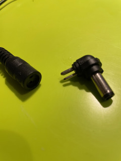

_This part is not very elegant. If you have a better solution, please let me know_

#### 1.4 Installing new counterweight

First slide in the Counterweight Part A so that the motoer weight sits snugly in the part head.

Then top it with Counterweight Part B and close it with a round of tape.

The holes allow to experiment with adding more weight, but I have not tried it yet as they may put to much stress on the motor.

### 2. Top

#### 2.1 Installing the motor

#### 2.2 Installing the cup

#### 2.3 Installing the springs

### 3. Base

#### 3.1 Rubber feet

#### 3.2 Connecting the top

## Running

## Contributing

### Try it out

* Make it and send feedback and pics
* Polish parts using different media, time and material combinations to build a catalog of ways of smoothing

### Advice

* A future version should have a better motor
	* Standard size that is easy to find around the world
	* Effective at 12V, because 24V power adapters cost much more
	* It has an easy way to attach an eccentric load to the axle
	* More powerful, but not much perhaps
	* It costs at most around 20$
	* It comes with detailed power and speed specs
	
* A future version needs a better way to connect power to the motor
	* A switch would be convenient
	* A potentiometer would be convenient too

* I love Fusion 360, but with the free version it's impossible to collaborate on the designs.
	* Does anyone know how to handle this?
	* Or shuld we redesign using open source tools, maybe OpenSCAD?

## Version History

V0.5

## Future

* Manage motor wire in a better way
* Safety Cage
* Switch
* Motor cooling to prevent plastic to go soft
* Spring locking mechanism
* Bracket for swapping cups
* Bracket for swapping weights
* Using a normal motor
* Diffeent size & power versions
* Noise management
* Analog speed control
* Analog Timer
* Analog Control (finishing programs)
* Share Fusion 360 Design (Needs commercial version)

## License

## Thanks and Inspiration

Links to similar designs online