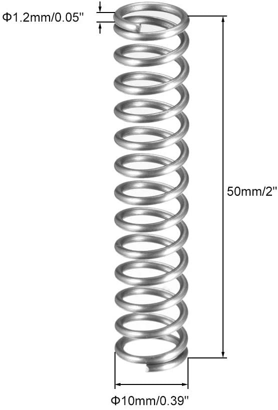

# Termite Labs - 3D Printed Vibratory Tumbler 

Version Micro 0.5

This is a small vibratory tumbler I put together with my 3D printer and parts I had available at home, but the goal is to create an open source, affortable, easy to print and assemble vibratory tumbler, useful for finsishing and polishing 3D printed parts or other objects.

__I need help improving this design. Go to the [Contributing](#contributing) section to help answer some questions.__

Photo, Video, Before/After

# !!! WARNING !!!
* This projects features a __rapidly spinning electric motor__ with an eccenric load
* __This can be dangerous, please be careful__ 
* __Do not assume this is safe just because it's on the internet__ 
* __I can't accept any responsibility if you or someone else gets hurt of property is damaged__

## Table Of Contents

* [Parts to print](#printing-the-parts)
* [The other parts](#non-printed-parts)
* [Assemblying](#assemblying)
* [Using](#using)
* [Future](#future)
* [Contributing](#contributing)
* [Acknowledgements](#acknowledgements)

## Printing the parts

* [Frame Base - V0.5 STL](Termite_Vibratory_Tumbler_Micro_V0.5-Frame_Base.stl)
* [Frame Top - V0.5 STL](Termite_Vibratory_Tumbler_Micro_V0.5-Frame_Base.stl)
* [Frame Weight Part A - V0.5 STL](Termite_Vibratory_Tumbler_Micro_V0.5-Weight_A.stl)
* [Frame Weight - Part B - V0.5 STL](Termite_Vibratory_Tumbler_Micro_V0.5-Weight_B.stl)

|       |  |
| ----------- | ----------- |
| [Frame Base STL](Termite_Vibratory_Tumbler_Micro_V0.5-Frame_Base.stl)      |        |
| [Frame Top STL](Termite_Vibratory_Tumbler_Micro_V0.5-Frame_Top.stl)      |        |
| [Weight Part A STL](Termite_Vibratory_Tumbler_Micro_V0.5-Weight_A.stl)      |        |
| [Weight Part A STL](Termite_Vibratory_Tumbler_Micro_V0.5-Weight_B.stl)      |        |

I printed my parts in eSun PLA+, 0.3mm layer height and medium speed for my printer. I recommend to use high setting for your layer height as it should make the parts stronger, at the cost of aesthetics. 

_(I designed this using Fusion 360, but I can't share the project to be edited by others because I'm using the free "hobby" version. Here is a [read-only link to the Fusion design](). Shout if you know how to fix this)_

## Non-printed parts

* 1x Motor
* 4x Springs
* 1x Container
* Nx My XXmm Screws with bolts
* Nx Washers
* 2x lengths of wire
* 1x 12 Power Adapater
* Rubber Feet
* Tumbling Media

### Motor

 I used what I had around. There is probably a better choice out there, but this seems to work for now with a small modification (explained below in the instructions). One great thing is that the existing counterweight doubles as a hook to attach our own counterweight.

 The parts are designed specifically around this motor, so unfortunaely you'll have to get exactly this part. I provided links for Amazon US and UK. If you find this part in other countries, or not on Amazon, please let me know and I can add it here.

 * [Amazon UK](https://www.amazon.co.uk/gp/product/B07Y7X3393)
 * [Amazon US](https://www.amazon.com/dp/B07Y7V5QRH)

### Springs

The base and top are designed specifically for springs of this size and length. I provided links for Amazon US and UK. If you find this part in other countries, or not on Amazon, please let me know and I can add it here.

* [Amazon UK](https://www.amazon.co.uk/gp/product/B07M6JT46T/)
* [Amazon US](https://www.amazon.com/uxcell-Diameter-Stainless-Extended-Compressed/dp/B07MHGLW1Q) (Seemps to be out of stock - help me find a substitute)

## Tools

| Soldering Iron |
| Solder 		 |
| 3D Printer	 |
| Pliers		 |

Disclosure: the links have have affiliate blah blah and I may earn a small commission if you buy through the link. I intend to use the commission to fund improvements to this project.

## Assemblying

### 1. Motor

#### 1.2 Removing counterweight

#### 1.3 Soldering

#### 1.4 Installing new counterweight

### 2. Top

#### 2.1 Installing the motor

#### 2.2 Installing the cup

#### 2.3 Installing the springs

### 3. Base

#### 3.1 Rubber feet

#### 3.2 Connecting the top

## Running

## Contributing

### Try it out

* Make it and send feedback and pics
* Polish parts using different media, time and material combinations to build a catalog of ways of smoothing

### Advice

* I need advice on choosing a motor for the next version:
	* Ideally it's of a standard size that is easy to find around the world
	* Ideally it's effective at 12V, because 24V power adapters cost much more
	* Idelaly it costs at most around 20$

* Redesign using open source tools?

## Version History

V0.5

## Future

* Manage motor wire in a better way
* Safety Cage
* Switch
* Motor cooling to prevent plastic to go soft
* Spring locking mechanism
* Bracket for swapping cups
* Bracket for swapping weights
* Using a normal motor
* Diffeent size & power versions
* Noise management
* Analog speed control
* Analog Timer
* Analog Control (finishing programs)
* Share Fusion 360 Design (Needs commercial version)

## License

## Thanks and Inspiration

Links to similar designs online