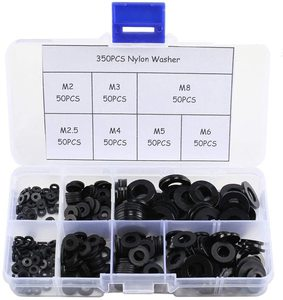

# Termite Labs - 3D Printed Vibratory Tumbler 

Version Micro 0.5

This is a small vibratory tumbler I put together with my 3D printer and parts I had available at home, but the goal is to create an open source, affortable, easy to print and assemble vibratory tumbler to be used for finsishing and polishing 3D printed parts or other objects.

This is a prototype and I welcome any help to improve the design. See [Contributing](#contributing) to know more.

Photo, Video, Before/After

## Safety Warning
* This projects features a __rapidly spinning electric motor__ with an eccenric load
* __This is dangerous, please be careful__ 
* __I can't accept any responsibility if you or someone else gets hurt or property is damaged__

## Table Of Contents

* [Materials](#materials)
* [Instructions](#instructions)
* [Tumbling](#tumbling)
* [Future](#future)
* [Contributing](#contributing)
* [Acknowledgements](#acknowledgements)

## Materials

Collect your materials, then head on to the [Instructions](#instructions). The only two things that you need to buy specifically as descibed are the springs and the motor. Most other things you can probably make do with what you have around, or find them at your local hardware store. I have included [links](#where_to_buy) to buy online for convenience.

I printed my parts in eSun PLA+, 0.3mm layer height and medium speed for my printer. I recommend to use high setting for your layer height as it should make the parts stronger, at the cost of aesthetics. 

_(I designed this using Fusion 360, but I can't share the project to be edited by others because I'm using the free "hobby" version. Here is a [read-only link to the Fusion design](https://a360.co/3a8lYfV). Shout if you know how to fix this)_

| Part | Instructions | Image |
|------|--------------|-------| 
| Frame Base | Print flat face down, no supports   [Download STL](TVT-Micro-0.5-Frame-Base.stl) | 
| Frame Top | Print flat face down, no supports   [Download STL](TVT-Micro-0.5-Frame-Top.stl) | 
| Weight Part A | Print flat face down, supports only in the head part   [Download STL](TVT-Micro-0.5-Weight-A.stl) | 
| Weight Part B | Print flat face down, no supports   [Download STL](TVT-Micro-0.5-Weight-B.stl) | 
| DC Motor |  The frame and weight are designed to fit exactly this motor.   I used what I had around. In future versions I would like to use a more common motor (see [Contributing](#contributing)), but this seems to work for now with a small modification (see [Instructions](#instructions)). The existing counterweight doubles as an attachment for our own counterweight. On the bad side, this motor does not come with any specs (power required or rotation speed).  [Where to Buy]() | 
| Springs | 4 Springs that connect the base to the top. The is designed to fit exactly the springs dimensions.   [Where to Buy]() | 
| Tumbling Container | I used what I had at home. Any round plastic cup approx 10cm (4") diameter should work. If you find a good one, please let me know. | 
| Screws and Bolts |   [Where to Buy]() | 
| Washers | I used plastic washers because thats what I had around, but any washers will do. _Note: all the vibrations are soosing the screws. If you have split washers try those. [Where to Buy]() | 
| 12V Power Adapter | I bought the ceapest 30W I could find. An adapter you already have may just work.   [Where to Buy]() | 
| Tumbling Media | I have improved here as I have no experiance with tumbling. I used 3 different things: lots of tiny screws, crushed walnut shells, and stainless steel pins. There are many more media to try. See more in [Using](#using) |   
| Rubber Feet | This is optional at this point as they don't work too well to keep the tumbler for moving around, but they help somewhat. | 
| Soldering Iron | Any soldering iron will do. I use an Hakko station and it'qrfrvfvava great.   [Where to Buy]() |  |
| Solder | Any solder should do.   [Where to Buy]() |   
| Hook Up Wire | To connect power to the motor.    [Where to Buy]() |
| Pliers | Used to modify the motor.   [Where to Buy]() |  |
| Zip Ties | Used to fix the wiring to the motor   [Where to Buy]() | 
| Tape | Used to fix the wiring to the frame until we come up with a better design. Any tape you have around will work. | 
| 3D Printer | Of course you also need a 3D Printer. I have a Monoprice Voxel (same as a FlashForge Adventurer 3). It's an entry level printer and it works perfectly. You should be fine whater printer you have. [Where to Buy]() | 

## Instructions

#### 1 Remove Motor Counterweight

* The first thing to do is to remove the counterweight on the front of the motor. The part __WITHOUT__ power connections. 
* Turn the motor and find the end that does __NOT__ have power connectors
* Grab the weight with a pair of pliers, gently twist it left and right until it comes off.

#### 2 Solder Motor Wires

* Turn the motor to the side with connectors.
* Notice how one of the connectors has red dot next to it. This useful later.
* Solder a length of wire to each of the connectors.
* Tie the wires to the motor with a tip tie. Keep the tie close to the connectors like in the image.

#### 3 Connect to the power adapter

* Now connect the wires to the power adapter. I have soldered them to a female standard DC plug compatible with one of the adapters provided with the power brick.

The motor has a red dot near the positive connector. Connect it to the positive wire coming from the adapter. In standard plugs this is in the center.

_This part is not very elegant. If you have a better solution, please let me know_

#### 1.4 Installing new counterweight

First slide in the Counterweight Part A so that the motoer weight sits snugly in the part head.

Then top it with Counterweight Part B and close it with a round of tape.

The holes allow to experiment with adding more weight, but I have not tried it yet as they may put to much stress on the motor.

### 2. Top

#### 2.1 Installing the motor

#### 2.2 Installing the cup

#### 2.3 Installing the springs

### 3. Base

#### 3.1 Rubber feet

#### 3.2 Connecting the top

## Tumbling

If all worked well, you should be ready to tumble your first part. 

1. Pour the tumbling media in the cup and close
2. Start it. If the rubber feet don't prevent it to move around, tryin placing something underneath like a heavy cloth or nest it between two heavy objects like two large books. I'm trying to figure out a better solution.
3. Let it go, it's going to take a while, perhaps hours to make a difference, depending on the part and the media.
4. For 3D printed parts, I'm first tumbling with screws, then steel needles and finish it off with walnut shells. I'll post before/after pictures.

## Contributing

I would very much like to see thi eveolve over time and become a robust, easy to build and affordable tumbler that anyone can put together without special skills or tools beyond access to a 3D printer.

Any contribution is absolutely welocome, in any form or shape. Below is a list of things that I know are needed, but it's not limited to that.

### Help Needed

* Build it and take pictures of the process and your results

* Improve the instructions

* Polish parts using different media/time/object combinations to help me build a catalog of techniques for finishing parts

* If you have any thoughts on things that can be improved or should be changed, let me know.

* A future version needs a better way to connect power to the motor
	* A switch would be convenient
	* A potentiometer would be convenient too

* A future version needs a better motor
	* Standard size that is easy to find around the world
	* Effective at 12V, because 24V power adapters cost much more
	* It has an easy way to attach an eccentric load to the axle
	* More powerful, but not much perhaps
	* It costs at most around 20$
	* It comes with detailed power and speed specs
	
* I love Fusion 360, but with the free version it's impossible to collaborate on the designs.
	* Does anyone know how to handle this?
	* Or shuld we redesign using open source tools, maybe OpenSCAD?

## Version History

V0.5

## Future

* Manage motor wire in a better way
* Safety Cage
* Switch
* Motor cooling to prevent plastic to go soft
* Spring locking mechanism
* Bracket for swapping cups
* Bracket for swapping weights
* Using a normal motor
* Diffeent size & power versions
* Noise management
* Analog speed control
* Analog Timer
* Analog Control (finishing programs)
* Share Fusion 360 Design (Needs commercial version)

## License

This is open source. I don't know yet what's the best licence for an open source hardware project.

## Where to buy

I'm tyring to make sure the parts that can't be printed are widely available and trying to provide links to them. If your country is not listed, or the part is difficult to find, let me know.  Most items are commonly found at your local hardware store. _If anyone know a btter way to do this, let me know..._

_Some of the links provided contain affiliate links. The price remains the same for you, but I may receive a small percentage of the sale price, which I will spend to fund this and other projects._

For the motor and springs, pay attentions to the links tagged with __*__: the product looks like the the one I used, but I could not confirm it's excatly the same. __I rely on your feedback to make sure they work working.__

| | | | | | | | | |
|----|---|---|---|---|---|---|---|---| 
| Motor 	| *[USA](https://amzn.to/3anLfTA) | [U.K.](https://amzn.to/3mzgGN5) | *[Italy](https://amzn.to/2LUwXzE) | *[France](https://amzn.to/3p37aU2) | *[Spain](https://amzn.to/38oDMRC) | *[Germany](https://amzn.to/38jFcg1) | India(N/A) | *[Japan](https://www.amazon.co.jp/-/en/Vibration-Electric-Oscillating-Powerful-Excenters/dp/B07Y67FJR2/ref=sr_1_4?dchild=1&keywords=Vibration+Motor+DC+12V&qid=1608531665&sr=8-4) | 
| Springs	| *[USA]() | [U.K.]() | *[Italy]() | *[France]() | *[Spain]() | *[Germany]() | *[India]() | *[Japan]() | 
| Screws and Bolts | [USA]() | [U.K.]() | [Italy]() | [France]() | [Spain]() | [Germany]() | [India]() | [Japan]() | 
| Washers | [USA]() | [U.K.]() | [Italy]() | [France]() | [Spain]() | [Germany]() | [India]() | [Japan]() | 
| 12V Power Adapter | [USA]() | [U.K.]() | [Italy]() | [France]() | [Spain]() | [Germany]() | [India]() | [Japan]() | 
| Tumbling Media - Screws | [USA]() | [U.K.]() | [Italy]() | [France]() | [Spain]() | [Germany]() | [India]() | [Japan]() | 
| Tumbling Media - Walnut Shells | [USA]() | [U.K.]() | [Italy]() | [France]() | [Spain]() | [Germany]() | [India]() | [Japan]() | 
| Tumbling Media - Steel Pins | [USA]() | [U.K.]() | [Italy]() | [France]() | [Spain]() | [Germany]() | [India]() | [Japan]() | 
| Rubber Feet | [USA]() | [U.K.]() | [Italy]() | [France]() | [Spain]() | [Germany]() | [India]() | [Japan]() | 
| Soldering Iron - Hakko FX-888D | [USA]() | [U.K.]() | [Italy]() | [France]() | [Spain]() | [Germany]() | [India]() | [Japan]() | 
| Solder | [USA]() | [U.K.]() | [Italy]() | [France]() | [Spain]() | [Germany]() | [India]() | [Japan]() | 
| Wire | [USA]() | [U.K.]() | [Italy]() | [France]() | [Spain]() | [Germany]() | [India]() | [Japan]() | 
| Zip Ties | [USA]() | [U.K.]() | [Italy]() | [France]() | [Spain]() | [Germany]() | [India]() | [Japan]() | 
| Pliers | [USA]() | [U.K.]() | [Italy]() | [France]() | [Spain]() | [Germany]() | [India]() | [Japan]() | 
| Tape | [USA]() | [U.K.]() | [Italy]() | [France]() | [Spain]() | [Germany]() | [India]() | [Japan]() | 
| 3D Printer  - Monoprice Voxel | [USA]() | [U.K.]() | [Italy]() | [France]() | [Spain]() | [Germany]() | [India]() | [Japan]() | 
| 3D Printer  - Flashforge Adventurer 3 | [USA]() | [U.K.]() | [Italy]() | [France]() | [Spain]() | [Germany]() | [India]() | [Japan]() | 
| eSUN PLA+ Filament | [USA]() | [U.K.]() | [Italy]() | [France]() | [Spain]() | [Germany]() | [India]() | [Japan]() | 

## Acknowledgments

I did not invent this. I took inspiration from videos I found on youtube. I made this because I don't have a workshop or tools to make this in wood, but I do have a 3D Printer, so there you go.

Some of the designs I found online:

* [How To make a Vibratory Tumbler Machine](https://www.youtube.com/watch?v=lXknqxaYgPY&t=185s)
* [DIY Tumbler Machine for Polishing Metal](https://www.youtube.com/watch?v=L3E-t8hNbGo)
* [DIY Vibratory Tumbler - Shop Projects](https://www.youtube.com/watch?v=S2Pq3ZCftGU)
* [DIY - How to Make Tumbler Machine for Restoration Making with 12 Volts DC Fan](https://www.youtube.com/watch?v=Tck5VvBplBU)
* [Buratto fai da te CON VENTOLA - Tumbler Machine DIY With FAN, low noise](https://www.youtube.com/watch?v=_1c_5yf9vLY&t=150s)