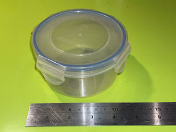
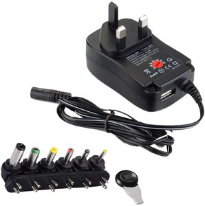
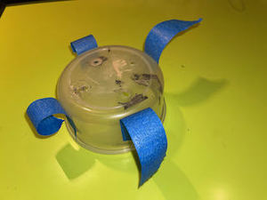
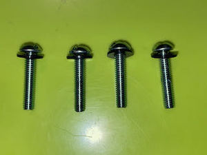
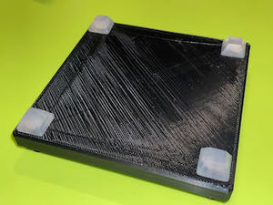

# Termite Labs - 3D Printed Vibratory Tumbler 

Version Micro 0.5

This is a small vibratory tumbler I put together with my 3D printer and parts I had available at home, but the goal is to create an open source, affortable, easy to print and assemble vibratory tumbler to be used for finsishing and polishing 3D printed parts or other objects.

This is a prototype and I welcome any help to improve the design. See [Contributing](#contributing) to know more.

## Safety Warning
* This projects features a __rapidly spinning electric motor__ with an eccenric load
* __This is dangerous, please be careful__ 
* __I can't accept any responsibility if you or someone else gets hurt or property is damaged__

## Table Of Contents

* [Materials](#materials)
* [Instructions](#instructions)
* [Tumbling](#tumbling)
* [Future](#future)
* [Contributing](#contributing)
* [Acknowledgements](#acknowledgements)

## Materials

Collect your materials, then head on to the [Instructions](#instructions). The only two things that you need to buy specifically as descibed are the springs and the motor. Most other things you can probably make do with what you have around, or find them at your local hardware store. Amazon [links](#where-to-buy) for all the material are at the bottom of the page.

| Part | Instructions | Image |
|------|--------------|-------| 
| Frame Base | Print flat face down, no supports   [Download STL](TVT-Micro-0.5-Frame-Base.stl) | 
| Frame Top | Print flat face down, no supports   [Download STL](TVT-Micro-0.5-Frame-Top.stl) | 
| Weight Part A | Print flat face down, supports only in the head part   [Download STL](TVT-Micro-0.5-Weight-A.stl) | 
| Weight Part B | Print flat face down, no supports   [Download STL](TVT-Micro-0.5-Weight-B.stl) | 
| DC Motor |  The frame and weight are designed to fit exactly this motor.   This works, but in future versions I would like to use a more common motor (see [Contributing](#contributing). The existing counterweight doubles as an attachment for our own counterweight. On the bad side, this motor does not come with any specs (power required or rotation speed). | 
| Springs | 4 Springs that connect the base to the top. The is designed to fit exactly the springs dimensions. | 
| Tumbling Container | I used what I had at home. Any round plastic cup approx 10cm (4") diameter should work. If you find a good one, please let me know. | 
| Screws, Bolts and Washers | * 2x M2 14mm screws   * 4x M4 28mm screws   * 8x M4 Bolts   * 8 M4 Washers   2 M2 Washers   I used plastic washers, but I suspect any will do  | 
| 12V Power Adapter | I bought the ceapest 30W I could find. This one is convenient because it comes with multiple connectors. An adapter you already have may just work.| 
| DC Plug Connectors | | 
| Rubber Feet | Just some rubber feet to limit the tmbler moving around. These are not very effective. | 
| Tumbling Media | |   
| Soldering Iron | You'll need to solder two wires to the motor. It's a small job and any soldering iron will do. I use an Hakko station, it's great. |  |
| Solder | Any solder should do.  |   
| Hook Up Wire | To connect power to the motor.   | 
| Pliers | Used to modify the motor.  |  |
| Zip Ties | 1 Zip tie, used to fix the wiring to the motor | 
| 3D Printer | Of course you also need access to a 3D Printer. I use a Monoprice Voxel (same as a FlashForge Adventurer 3). It's an entry level printer and it works perfectly. You should be fine whater printer you have. | 

## Instructions

### 1. Print the parts

Print all 4 STL files. I had good reusults with PLA+ at 0.3mm layer height and medium speed

### 2. Remove Motor Counterweight

Needed: Motor, Pliers

1. Identify the end of the motor hthat does __NOT__ have power connectors
2. Grab the weight with a pair of pliers, gently twist it left and right until it comes off.

### 3. Attach the motor to the frame top

Needed: Frame Top, Motor, M2 Washers, M2 Screws

Watch out: if your screws are too long and are screwed too deep into the motor, the motor will not turn properly. 

1. Fit 2 washers on 2 M2 14mm screws
2. Put the screws in their holes on the Frame Top
3. Fit 2 washers on the other side of the screws
4. Fit the motor in the socket to match the screw holes to the screws
5. Turn the screws until the motor is snug
6. Test that the motor can still turn. If it does not turn properly, the screws are too deep. Start over adding more washers on the front side, until it works properly.

#### 4. Wire the motor

Neede: Motor, Hook up wire, Soldering Iron, Solder, Zip Tie

1. Cut two lengths of hook-up wire (~15cm/6") of different colors, red and black if possible and strip the ends
2. Solder the red wire to the + connector (marked with the red dot)
3. Solder the black wire to the - connector
4. Fit the wires in the frame cut
5. Tie the wires to the motor with a zip tie and cut the excess plastic

### 5. Connect to the power adapter

Needed: Motor, Female DC Connector, DC Adapter

1. Connect the wires to the power Female DC Connector. Make sure the + wire connects to the + sign on the connector
2. If your DC adapter has universal connectors, find the one that fits the connector you just wired, and you are done.
3. If your connector does not have an adapter, strip the ends and connect them to a Male DC Connector. 
6. Tape over the wire to keep it place

### 6. Install the new counterweight

First slide in the Counterweight Part A so that the motoer weight sits snugly in the part head.

Then top it with Counterweight Part B and close it with a round of tape.

### 7. Prepare the Tumbling Cup

1. Apply some tape on the sides of the cup
2. Put the cup over the top and tape it down firmly
3. Identify the screw holes and mark them with a marker
4. Take off the cup and drill holes
5. Apply rubber feet under the cup. These help with vibration and noise.

### 8. Install the Tumbling Cup.

1. Fit 4 washers to 4 M4 screws
2. Put the screws through the cup and base
3. Add a washer and a bold on the other side

### 9. Install the base

1. Stick 4 rubber feet to the bottom of the base
2. Firmly push the spring into place on both frames, and you are done!

### 10. Tumble!

For tumbling I'm trying different media, and I'll try more over time. Any suggestion is welcome!

* Screws - for gross details. It left a black patina on the parts. The patina comes off eventually with some brushing and further tumbling. It needs a few hours.
* Steel pins - intermediate
* Crushed Walnut Shells - final step for polishing

## Contributing

I would very much like to see thi eveolve over time and become a robust, easy to build and affordable tumbler that anyone can put together without special skills or tools beyond access to a 3D printer.

Any contribution is absolutely welocome, in any form or shape. He.re is a list of my priorities, but I'm sure there is more.

### Help Needed

* Make It 
	* Take pictures of the process and your results
	* Share any feedback, especially suggestions for improvements.
	* Polish parts using different media/time/object combinations to help me build a catalog of techniques for finishing parts
	* Improve the instructions

* Have a look at the open issues, maybe you can help: [Open Issues](https://github.com/termite-labs/3d-printed-vibratory-tumbler/issues)

* Help improve the design

	* Come up with a better motor, with these features, roughly in order of priority:
		* Standard size that is easy to find around the world
		* It has an easy way to attach an eccentric load to the axle
		* Does not require soldering to connect, so it's accessible to more people		
		* Effective at 12V, because 24V power adapters cost much more				

	* Improve power management:
		* An ON/OFF Switch
		* A potentiometer to control speed
		* Ideally no soldering, so it's accessible to more people		
	
	* I designed this with Fusion 360, which is just great but it's impossible to collaborate on the designs with the free version
		* Does anyone know a workaround?
		* Or shuld we redesign using open source tools, maybe OpenSCAD?

## Version History

V0.5

## Future

* Manage motor wire in a better way
* Safety Cage
* Switch
* Motor cooling to prevent plastic to go soft
* Spring locking mechanism
* Bracket for swapping cups
* Bracket for swapping weights
* Using a normal motor
* Diffeent size & power versions
* Noise management
* Analog speed control
* Analog Timer
* Analog Control (finishing programs)
* Share Fusion 360 Design (Needs commercial version)

## License

This is open source. I don't know yet what's the best licence for an open source hardware project.

## Where to buy

I'm tyring to make sure the parts that can't be printed are widely available and trying to provide links to them. If your country is not listed, or the part is difficult to find, let me know.  Most items are commonly found at your local hardware store. _If anyone know a btter way to do this, let me know..._

_Some of the links provided contain affiliate links. The price remains the same for you, but I may receive a small percentage of the sale price, which I will spend to fund this and other projects._

For the motor and springs, pay attentions to the links tagged with __*__: the product looks like the the one I used, but I could not confirm it's excatly the same. __I rely on your feedback to make sure they work working.__

| | | | | | | | | |
|----|---|---|---|---|---|---|---|---| 
| Motor 	| *[USA](https://amzn.to/3anLfTA) | [U.K.](https://amzn.to/3mzgGN5) | *[Italy](https://amzn.to/2LUwXzE) | *[France](https://amzn.to/3p37aU2) | *[Spain](https://amzn.to/38oDMRC) | *[Germany](https://amzn.to/38jFcg1) | India(N/A) | *[Japan](https://www.amazon.co.jp/-/en/Vibration-Electric-Oscillating-Powerful-Excenters/dp/B07Y67FJR2/ref=sr_1_4?dchild=1&keywords=Vibration+Motor+DC+12V&qid=1608531665&sr=8-4) | 
| Springs	| *[USA]() | [U.K.]() | *[Italy]() | *[France]() | *[Spain]() | *[Germany]() | *[India]() | *[Japan]() | 
| Screws and Bolts | [USA]() | [U.K.]() | [Italy]() | [France]() | [Spain]() | [Germany]() | [India]() | [Japan]() | 
| Washers | [USA]() | [U.K.]() | [Italy]() | [France]() | [Spain]() | [Germany]() | [India]() | [Japan]() | 
| 12V Power Adapter | [USA]() | [U.K.]() | [Italy]() | [France]() | [Spain]() | [Germany]() | [India]() | [Japan]() | 
| Tumbling Media - Screws | [USA]() | [U.K.]() | [Italy]() | [France]() | [Spain]() | [Germany]() | [India]() | [Japan]() | 
| Tumbling Media - Walnut Shells | [USA]() | [U.K.]() | [Italy]() | [France]() | [Spain]() | [Germany]() | [India]() | [Japan]() | 
| Tumbling Media - Steel Pins | [USA]() | [U.K.]() | [Italy]() | [France]() | [Spain]() | [Germany]() | [India]() | [Japan]() | 
| Rubber Feet | [USA]() | [U.K.]() | [Italy]() | [France]() | [Spain]() | [Germany]() | [India]() | [Japan]() | 
| Soldering Iron - Hakko FX-888D | [USA]() | [U.K.]() | [Italy]() | [France]() | [Spain]() | [Germany]() | [India]() | [Japan]() | 
| Solder | [USA]() | [U.K.]() | [Italy]() | [France]() | [Spain]() | [Germany]() | [India]() | [Japan]() | 
| Wire | [USA]() | [U.K.]() | [Italy]() | [France]() | [Spain]() | [Germany]() | [India]() | [Japan]() | 
| Zip Ties | [USA]() | [U.K.]() | [Italy]() | [France]() | [Spain]() | [Germany]() | [India]() | [Japan]() | 
| Pliers | [USA]() | [U.K.]() | [Italy]() | [France]() | [Spain]() | [Germany]() | [India]() | [Japan]() | 
| Tape | [USA]() | [U.K.]() | [Italy]() | [France]() | [Spain]() | [Germany]() | [India]() | [Japan]() | 
| 3D Printer  - Monoprice Voxel | [USA]() | [U.K.]() | [Italy]() | [France]() | [Spain]() | [Germany]() | [India]() | [Japan]() | 
| 3D Printer  - Flashforge Adventurer 3 | [USA]() | [U.K.]() | [Italy]() | [France]() | [Spain]() | [Germany]() | [India]() | [Japan]() | 
| eSUN PLA+ Filament | [USA]() | [U.K.]() | [Italy]() | [France]() | [Spain]() | [Germany]() | [India]() | [Japan]() | 

## Acknowledgments

I did not invent this. I took inspiration from videos I found on youtube. I made this because I don't have a workshop or tools to make this in wood, but I do have a 3D Printer, so there you go.

Some of the designs I found online:

* [How To make a Vibratory Tumbler Machine](https://www.youtube.com/watch?v=lXknqxaYgPY&t=185s)
* [DIY Tumbler Machine for Polishing Metal](https://www.youtube.com/watch?v=L3E-t8hNbGo)
* [DIY Vibratory Tumbler - Shop Projects](https://www.youtube.com/watch?v=S2Pq3ZCftGU)
* [DIY - How to Make Tumbler Machine for Restoration Making with 12 Volts DC Fan](https://www.youtube.com/watch?v=Tck5VvBplBU)
* [Buratto fai da te CON VENTOLA - Tumbler Machine DIY With FAN, low noise](https://www.youtube.com/watch?v=_1c_5yf9vLY&t=150s)